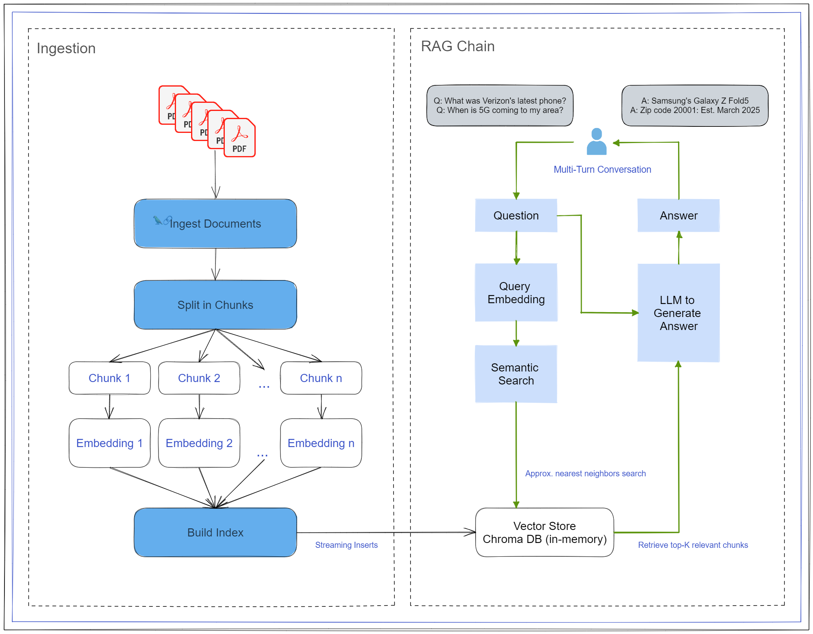

# Verizon Sales and Support Agent with LangChain

Python implementation of a support agent capable of discerning a customer/user's motivation and responding with the appropriate personality (tech support vs. sales) to serve their needs.

The project uses LangChain's framework for chaining an augmented retrieval function to a chat LLM to provide document Q&A capabilities. The Agent uses the same LLM and a set of tools with predefined use-cases and retrieval mechanisms to interpret the user input and respond with the appropriate tool. The data used in this repo is a collection of Verizon FAQ materials scraped from their blog.

This is a rudimentary approach approximating a large-scale chatbot service with billing that scales with customer demand and intelligent Q&A capabilities on a personalized dataset.

